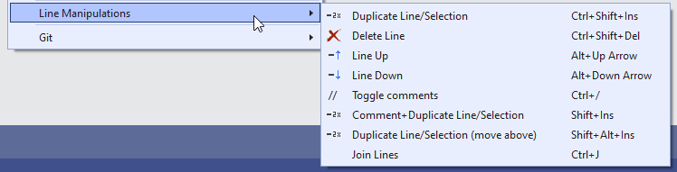
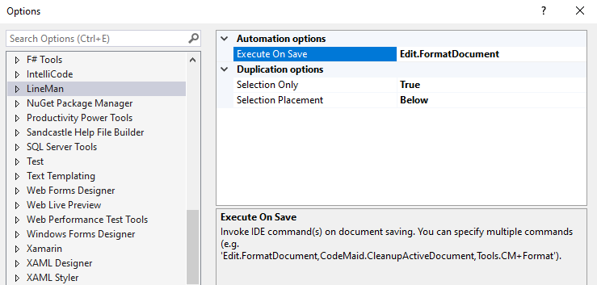

*This is a source code and defect tracking repository only. For all binaries please visit the product [Visual Studio Marketplace](https://marketplace.visualstudio.com/items?itemName=OlegShilo.LineMan) page.*

_The extension has been rebuilt for VS2022. For older (pre-VS2022) releases please visit https://github.com/oleg-shilo/Retired-VSIX_

Please note that some of the extension functionality is currently available in Visual Studio out of the box but you may still find it useful. Particularly if you already being using LineMan with early versions of Visual Studio.

---

These useful line/selection manipulation routines are usually parts of the other bigger products/extensions. Unfortunately, some of them are no longer available with their original packages (e.g. Productivity Power Tools). So I recreated them from scratch.

_**Important point is that the extension does not use (pollute) Clipboard.**_

The functionality is self-explanatory:
- Duplicate Line/Selection. (see Tools > Options > LineMan for customization)
  When single or multiline selection is made the extension brings the duplicated content in a new line. This makes it more useful than a built-in VS "duplicate line" command. You can also specify the placement (above/below) of the duplicated text.
- Delete Line
- Line Up
- Line Down
- Join Lines
- Toggle Comments
  This functionality is very similar to another rather excellent extension Toggle Comment ("https://marketplace.visualstudio.com/items?itemName=munyabe.ToggleComment"). Arguably, Lineman.ToggleComments is not as versatile, but it uses a more common comment prefix with extra space:  `// comment` instead `//comment`.
- Comment+Duplicate Line/Selection".
  It's the same as the primary command "Duplicate lien/selection" except it comments out the original selection when executed.
- Execute IDE command(s) on save.
  The commands are executed asynchronously so it allows solving some rather difficult challenges like formatting Razor pages (built-in IDE's FormatOnSave does not handle it in at least in v17.4.2).
  Use 'Tools > Options > LineMan' for defining the desired command.

## Product Screenshots

If the built-in shortcuts are in conflict with other extensions you may need to reassign them from the Visual Studio options dialog.

